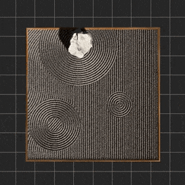

### 🗻 🍃 Generative landscape, meditation garden, zen field.

The central idea of this small side projects is that Vibert wanted to create a space where you can meditate in the browser. He is strongly impressed by the Zen Gardens when he visited the ancient city Kyoto.

